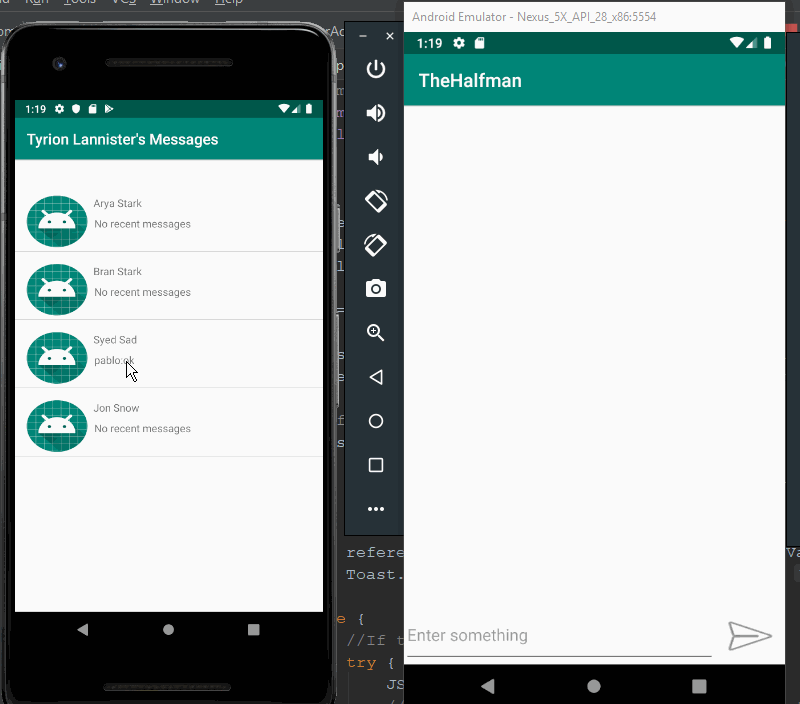

# Simple Chat App

A simple chat application with a firebase back-end. 

Submitted by: **Syed Sadman**

# Features
The app has the following features:

* [X] Users can sign in and register
* [X] Users can chat with other users of the app
* [ ] Users can engage in a group chat 
* [ ] Share images and videos

Quick Demo             
:-------------------------:

## To-DO

- Group chat option
- Ability to share multimedia

## License

    Copyright [2019] [Syed Sadman]

    Licensed under the Apache License, Version 2.0 (the "License");
    you may not use this file except in compliance with the License.
    You may obtain a copy of the License at

        http://www.apache.org/licenses/LICENSE-2.0

    Unless required by applicable law or agreed to in writing, software
    distributed under the License is distributed on an "AS IS" BASIS,
    WITHOUT WARRANTIES OR CONDITIONS OF ANY KIND, either express or implied.
    See the License for the specific language governing permissions and
    limitations under the License.

